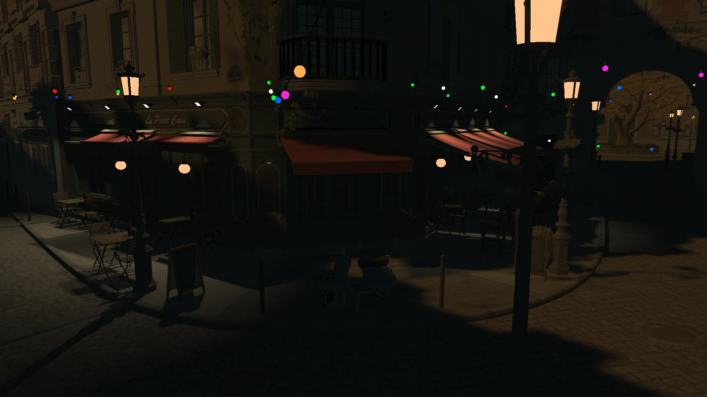
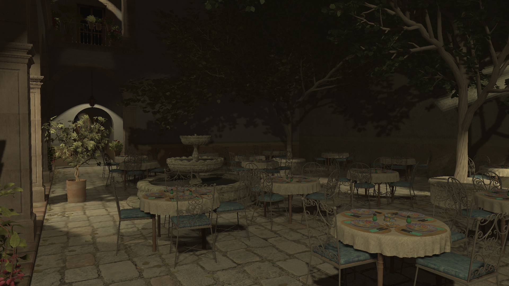
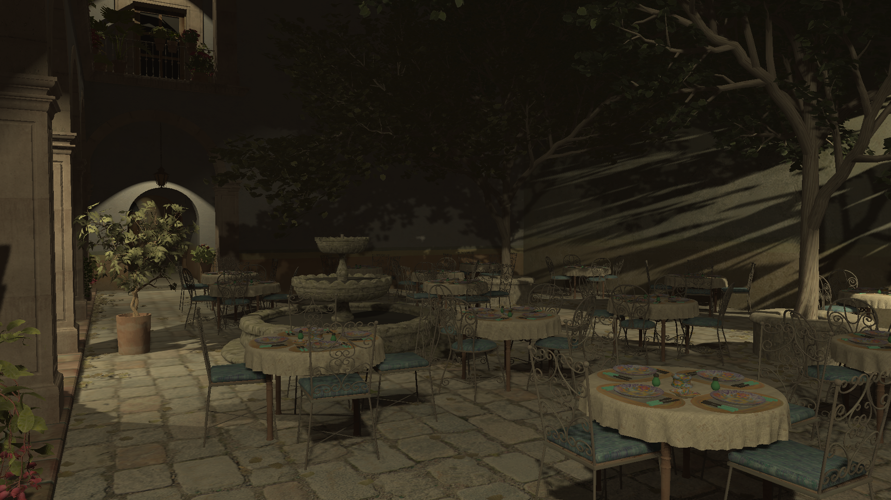
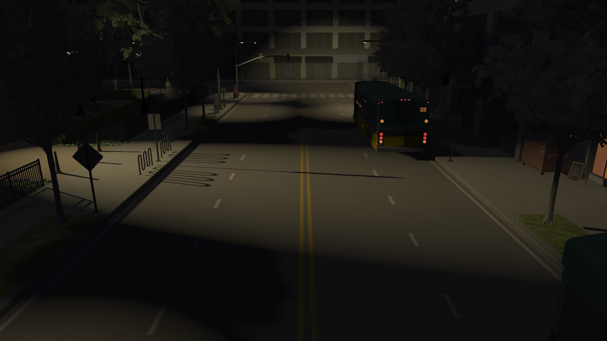
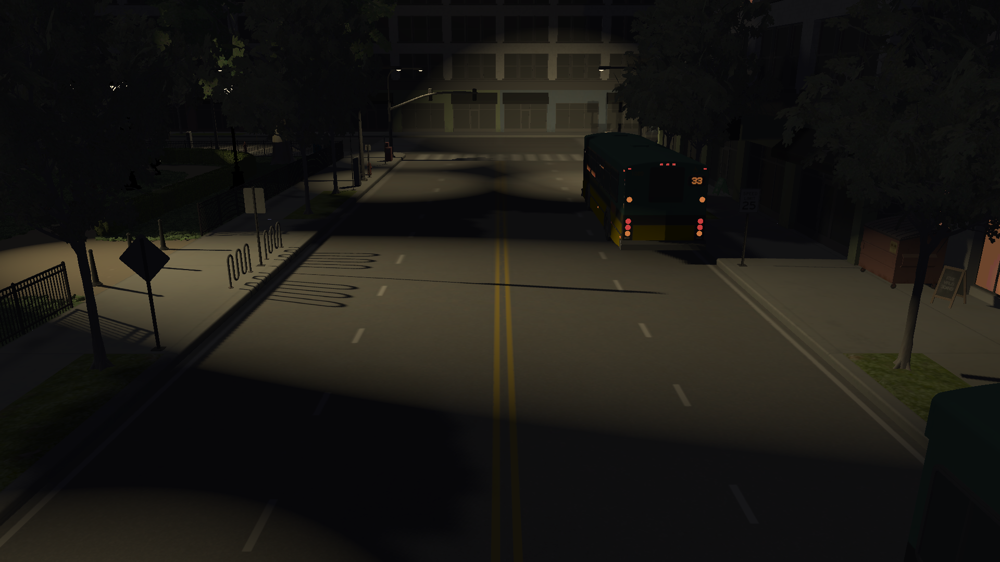

# Adaptive Resolution Imperfect Shadow Maps in Many-Light Rendering

This project builds on the work by Zhang et al. (2025) and investigates the viability of adaptive resolution imperfect shadow maps.

## Prerequisites
This project uses CMake as its build system. Please make sure you have CMake version 3.10 or newer and then run the SETUP.bat file. This will generate a Visual Studio solution in the build folder as well as download and extract the Amazon Lumberyard Bistro, NVIDIA Emerald Square and San Miguel 2.0 3d scenes.

## Resulting Renders
Adaptive ISM

Reference

Adaptive ISM

Reference

Adaptive ISM

Reference

## Third Party Notices

[Third Party Notices](THIRD_PARTY_NOTICES.md)

## Resources
Many-Light Rendering Using ReSTIR-Sampled Shadow Maps 
https://onlinelibrary.wiley.com/doi/full/10.1111/cgf.70059

Imperfect shadow maps for efficient computation of indirect illumination 
https://doi.org/10.1145/1409060.1409082
